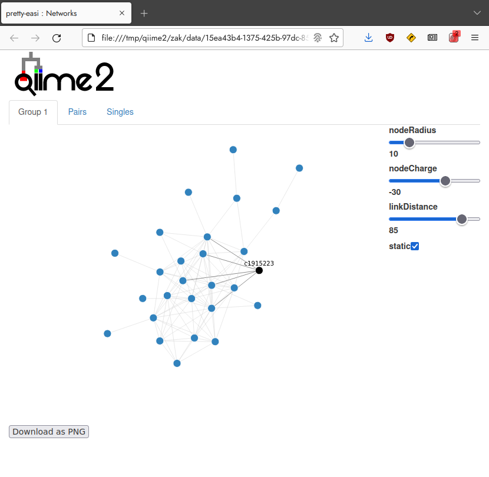
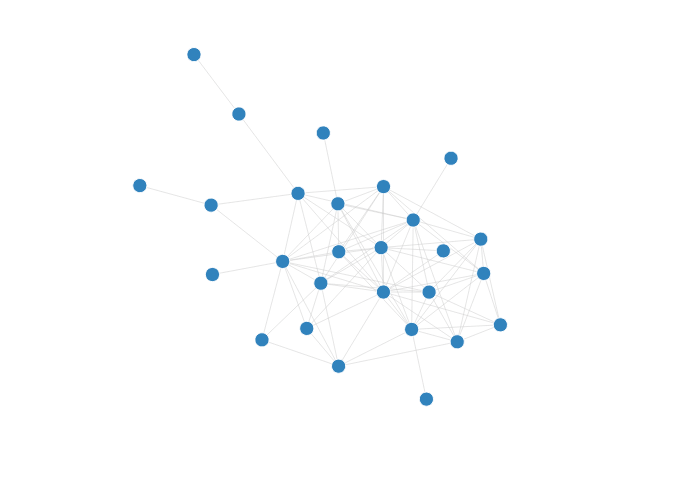

# pretty-easi

pretty-easi is a plugin to incorporate some functionality from the  [SpiecEasi](https://github.com/zdk123/SpiecEasi) package into the QIIME 2 environment together with additional network visualisation.

## What is involved

### QIIME2


[QIIME 2](https://qiime2.org/) is a powerful, extensible, and decentralized microbiome analysis package with a focus on data and analysis transparency. QIIME 2 enables researchers to start an analysis with raw DNA sequence data and finish with publication-quality figures and statistical results.

### SpiecEasi

SpiecEasi (Sparse InversE Covariance estimation for Ecological Association and Statistical Inference) is an [R based](https://www.r-project.org/) package which allows the user to infer microbial ecological networks from compositional datasets typically generated from 16S amplicon sequencing. 

### Plug-in Features

pretty-easi is at the $\alpha$ stage. In addition to wrapping the SpiecEasi package it provides a visualisation for generated networks. As development continues additional features will be listed here.

<!-- Things not in the plugin / either no included or not completed -->
<!-- qiime spieceasi --citations  -->
<!-- qiime spieceasi --example-data  -->

## Installation

pretty-easi requires a working QIIME 2 environment. The recommended way to [install](https://docs.qiime2.org/2022.8/install/native/) QIIME 2 is through [miniconda](https://docs.conda.io/en/latest/miniconda.html). Miniconda can be conveniently installed using the native package managers of various Linux distributions.  See the instructions for RPM-based and Debian-based distributions [here](https://docs.conda.io/projects/conda/en/latest/user-guide/install/rpm-debian.html). Arch Linux users can find miniconda in the [AUR](https://aur.archlinux.org/packages/miniconda3).

Once miniconda has been installed, issue the following commands within the shell
```
conda update conda
conda install wget
```
and install QIIME 2
```
wget https://data.qiime2.org/distro/core/qiime2-2022.8-py38-linux-conda.yml
conda env create -n qiime2-2022.8 --file qiime2-2022.8-py38-linux-conda.yml
```

Test the installation with `qiime --help`. An error free output means successful installation and the QIIME 2 environment can be activated. For example, 

```
conda activate qiime2-2022.8
```

Now install the SpiecEasi package

```
conda install -c conda-forge r-spieceasi
```

A conda package for pretty-easi is intended future development. Currently, to install the plugin
1. Download the source files by either
	- ```git clone https://github.com/BenKaehler/pretty-easi```
	- or [clicking here](https://github.com/BenKaehler/pretty-easi/archive/refs/heads/main.zip) and extracting the zip file.
2. Change your working folder within the conda enviroment to your local source folder.
3. Issue the command ```pip install .``` or ```pip install setup.py```
4. Test the installation with ```qiime pretty-easi --help``` or ```qiime pretty-easi --version```

## Usage Examples

From within the conda environment create a working folder and move into it
```
mkdir pluginExample
cd pluginExample/
```

This folder will contain the QIIME 2 artefacts produced by pretty-easi at the completion of each example.

### Basic work flow 

The sequencing data for this example is derived from the [Sponge Microbiome Project](https://doi.org/10.1093/gigascience/gix077). In particular, we will use data for the [Suberitida](https://www.gbif.org/species/7682289) order of sponges. 

Download the data

```
wget https://github.com/ramellose/networktutorials/raw/master/Workshop%202021/sponges/Suberitida.biom
```
<details><summary>File details</summary>
The data file is in BIOM format with the following attributes

| Attribute        | Value                        |
|------------------|------------------------------|
| "creation-date"  | "2021-01-12T11:53:25.574128" |
| "format-url"     | "http://biom-format.org"     |
| "format-version" | Int32[2, 1]                  |
| "generated-by"   | "BIOM-Format 2.1.6"          |
|                  |                              |
| "id"             | "No Table ID"                |
| "nnz"            | 2023                         |
| "shape"          | Int32[62, 68]                |
| "type"           | ""                           |
</details>

The next step is to import the BIOM file as a frequency [FeatureTable](https://docs.qiime2.org/2022.8/semantic-types/) within QIIME 2.

```
qiime tools import --input-path Suberitida.biom \\
	--type 'FeatureTable[Frequency]' \\
	--input-format BIOMV210Format \\
	--output-path spongeFeatureTable.qza

#Imported Suberitida.biom as BIOMV210Format to spongeFeatureTable.qza
```
The QIIME 2 artefact ```spongeFeatureTable.qza``` should exist in the working folder if this command was successful. Now, we are ready to use pretty-easi to access the SpiecEasi algorithms to infer the microbial network. The most minimal command to generate the network requires the name of artefact containing the FeatureTable and the name of the intended output artefact containing the inferred network. 

```
qiime pretty-easi spiec-easi --i-table spongeFeatureTable.qza \
	--o-network spongeNet.qza
# Saved Network to: spongeNet.qza
```

From the ```spongeNet.qza``` network artefact a visualisation can be created and then viewed

```
qiime pretty-easi visualise-network --i-network spongeNet.qza --o-visualization spongeNet.qzv
#Saved Visualization to: spongeNet.qzv
qiime tools view spongeNet.qzv
```

The network images should open in your default browser. Alternatively, you can upload ```spongeNet.qva``` to [qiime2view](https://view.qiime2.org/). The network containing the largest number of members is in the tab labelled _Group 1_ , next largest network in the tab _Group 2_, and so on down. Trivial networks of two members and singletons are listed by feature in the _Pairs_ and _Singles_ tab respectively. 




### Options 

Several parameter options exist for ```qiime pretty-easi spiec-easi``` . For a full list of parameters and the defaults execute ```qiime pretty-easi spiec-easi --help```. Some examples are below.

The algorithm utilised to infer the network can be set with ```-p-method``` parameter switch and one of 3 keywords:
1. ```glasso``` [Graphical LASSO](https://academic.oup.com/biostatistics/article/9/3/432/224260) (default)
2. ``mb``  Neighbourhood selection or [Meinshausen and Bühlmann](https://projecteuclid.org/journals/annals-of-statistics/volume-34/issue-3/High-dimensional-graphs-and-variable-selection-with-the-Lasso/10.1214/009053606000000281.full) method 
3. ``slr`` Sparse and Low-Rank method

For example to infer the network from the example data using the MB method execute the command
```
qiime pretty-easi spiec-easi --i-table spongeFeatureTable.qza \\
	--o-network spongeNet.qza \\
	--p-method mb
```

The remaining parameters relate to selection of the optimal penalty $\lambda$ in each method's [lasso](https://en.wikipedia.org/wiki/Lasso_(statistics)) like optimization problem. The network inference algorithms search for the optimal $\lambda$ penalty where the complete graph and an empty graph are at the extremes of the search range. Essentially the process is finding a balance between network sparsity and least-squares fit. 

The range of $\lambda$ values tested is between ```--p-lambda-min-ratio```$\times\lambda_{max}$ and $\lambda_{max}$, where $\lambda_{max}$ is the theoretical upper bound on $\lambda$. This upper bound is  $\max|S|$, the maximum absolute value in the data correlation matrix.

The lambda range is sampled logarithmically ```--p-nlambda``` times.

