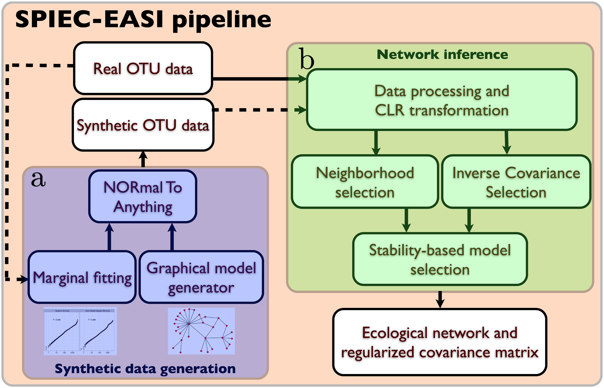

# Summary

**q2-prettyeasi** is a plugin for the QIIME 2 microbiome bioinformatics platform. The plugin allows the QIIME 2 community to infer microbial ecological networks from community composition data by which we can identify central species and their influence on the species who have interactions with that central species. 

# Statement of need

A microbiome is an inevitable part of life and it can have both positive and negative impacts on human health even though we ignore its presence [@berg2020microbiome]. Interaction of microbiome with itself and with its host may play a significance role in many areas; for example, food science [@singh2017microbiome; @torrazza2011developing], health science [@torrazza2011developing] and agricultural production. If it is possible to reveal the functions, interactions, temporal and spatial structures, and population dynamics of microbial communities, it will not only be a scientific discovery, but it will also contribute to human health, biotechnological development, agriculture, and environmental protection. Here we present a qiime2 plugin which will help to infer users infer microbial interactions by using network analysis.

**q2-prettyeasi** performs network analysis of microbiome data. It infers ecological interactions between microbial populations, by 

- taking advantage of the proportionality invariance of relative abundance data and 
- making assumptions about the underlying network structure when the number of taxa in the dataset is larger than the number of sampled communities [@kurtz2015sparse].

It provides several methods for neighbourhood selection, for example mb, glasso, slr etc, and uses StARS for model selection. There are several other parameters that are also used in this plugin, for more details please visit . The visualizations generated provide portable, shareable reports, publication-ready figures, and integrated decentralized data provenance. In addition, pretty-easy streamlines data handling and supports the use of multiple user interfaces, including a prototype graphical user interface (q2studio), facilitating its use for non-expert users. 

The q2-prettyeasi plugin is written both in Python  and R, and employs pandas [@mckinney2011pandas] for data manipulation, networkx [@hagberg2020networkx] and igraph [@csardi2006igraph] for network generation and visualization. The plugin is compatible with macOS and Linux operating systems.

{width=50%}

The standard workflow for q2-prettyeasi is shown in \autoref{fig:grl} [@kurtz2015sparse]. q2-prettyeasi action accept a input-file (i.e., matrix of feature counts per sample), method, lambda.min.ratio, nlambda, rep.num, ncores,  thresh, subsample.ratio, seed, sel.criterion, verbose, pulsar.select, lambda.log, lambda.min and lambda.max as input. All of the input parameter has default values except input-file.

# Acknowledgements

The authors acknowledge support from ...
